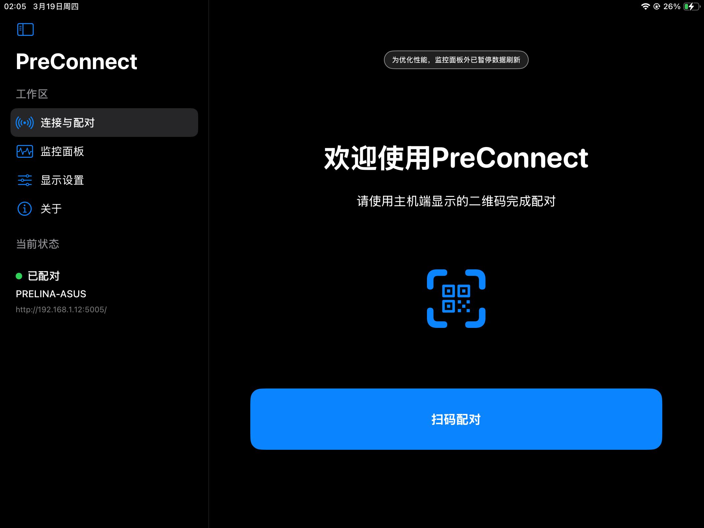
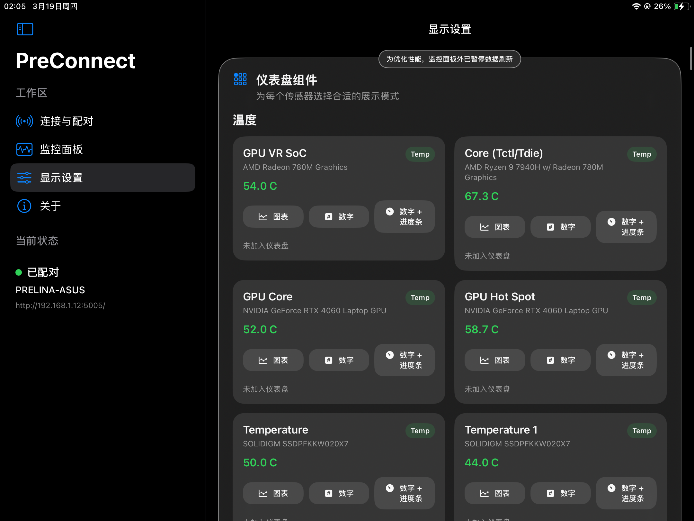
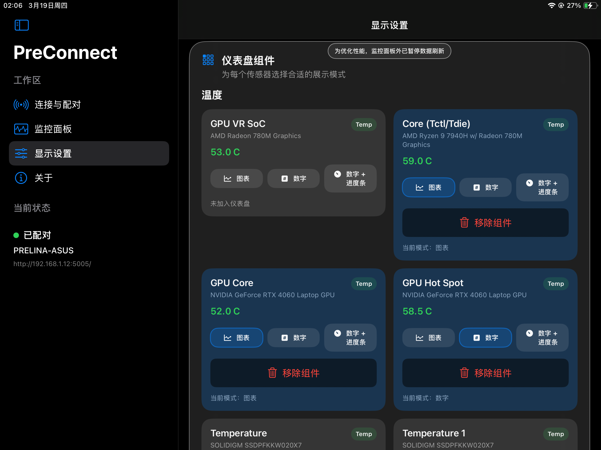
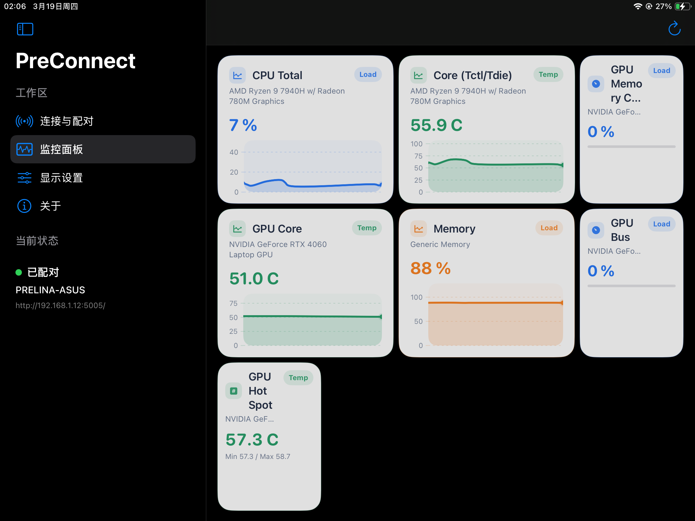

<p align="center">
  
</p>

<h1 align="center">PreConnect (iOS)</h1>

<p align="center">
  一个基于 SwiftUI 的硬件监控 iOS 客户端，支持扫码配对、实时遥测展示与可自定义仪表盘。
</p>

<p align="center">
  源码公开（Source-Available）｜禁止未经授权的商业使用
</p>

---

## 项目简介

PreConnect 是 PreConnect 体系中的 iOS 客户端，用于连接电脑端服务并展示硬件遥测信息（如温度、负载、功耗、风扇转速、频率等）。

- iOS 客户端仓库：本仓库
- 电脑客户端仓库：<https://github.com/PrelinaMontelli/PreConnect-PC>

---

## 核心功能

1. 二维码扫码配对，快速建立会话。
2. 实时遥测轮询与历史样本展示。
3. 可自定义仪表盘组件（图表/数值/进度条）与自动布局。
4. 可调整轮询频率，平衡实时性与性能。
5. 内置审核演示模式，无需连接电脑也可完整体验主要流程。

---

## 演示预览

<p align="center">
  
  
  
  
</p>

---

## 技术栈

- Swift 5
- SwiftUI
- Charts
- Combine
- URLSession
- Xcode Project（无额外复杂构建系统）

---

## 快速开始

### 环境要求

- macOS
- Xcode（建议使用较新稳定版本）
- iOS 18+（以工程设置为准）

### 本地运行

1. 克隆仓库。
2. 用 Xcode 打开 `PreConnect.xcodeproj`。
3. 选择 `PreConnect` Scheme。
4. 选择模拟器或真机后运行。

### 命令行构建（Simulator）

```bash
xcodebuild -project PreConnect.xcodeproj -scheme PreConnect -destination 'generic/platform=iOS Simulator' build
```

---

## 配对与数据来源说明

- 正常模式：连接电脑端 PreConnect 服务后获取真实遥测数据。
- 演示模式：使用应用内示例数据流，便于在无电脑环境下体验 Dashboard 与设置功能。

---

## 项目结构（简要）

- `PreConnect/ContentView.swift`：主界面与主要页面组织。
- `PreConnect/AppViewModel.swift`：会话状态、轮询、数据派生与业务逻辑。
- `PreConnect/APIClient.swift`：网络请求封装。
- `PreConnect/Models.swift`：数据模型与布局模型。
- `PreConnect/QRPayload.swift`：二维码载荷解析。

---

## 相关仓库

- 电脑客户端（Host）：<https://github.com/PrelinaMontelli/PreConnect-PC>

---

## 许可证

本项目使用仓库内 LICENSE.md 指定的许可证。

请注意：

- 本仓库为源码公开项目，不属于 OSI 定义的开源项目。
- 未经作者书面授权，禁止将本项目用于商业用途。
- 具体权利与限制以 LICENSE.md 为准。